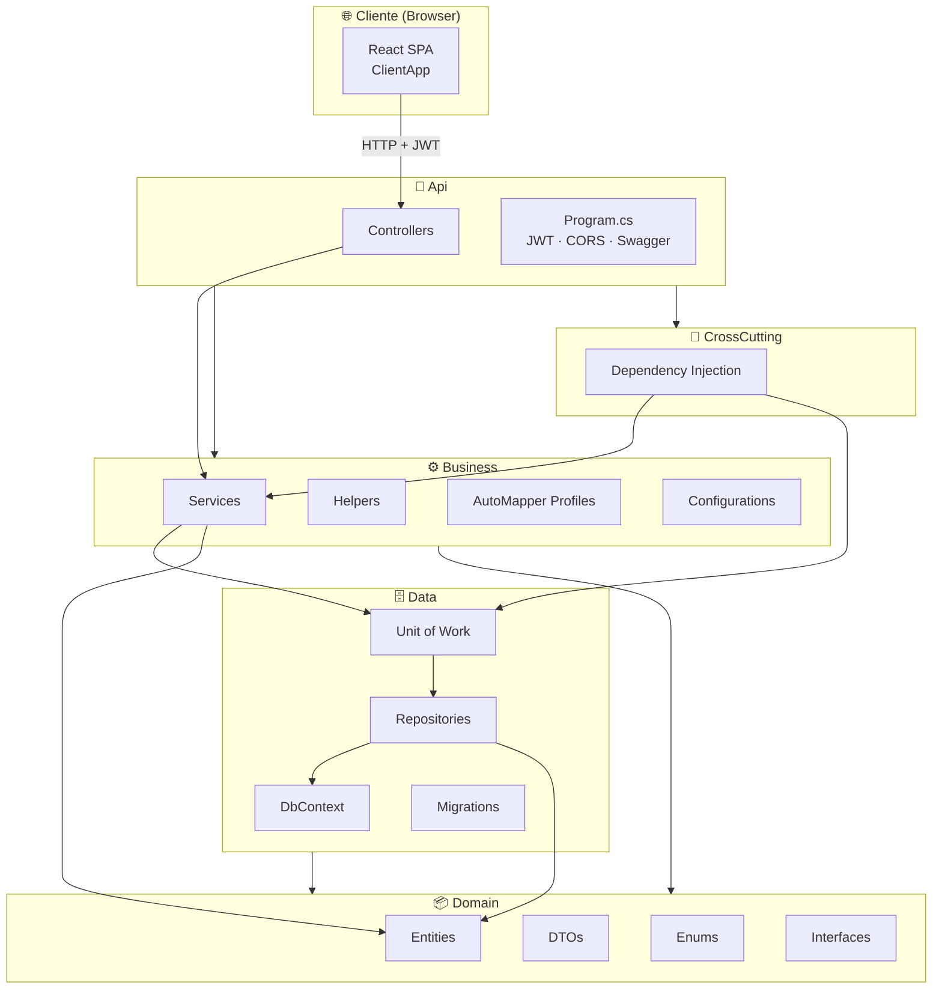
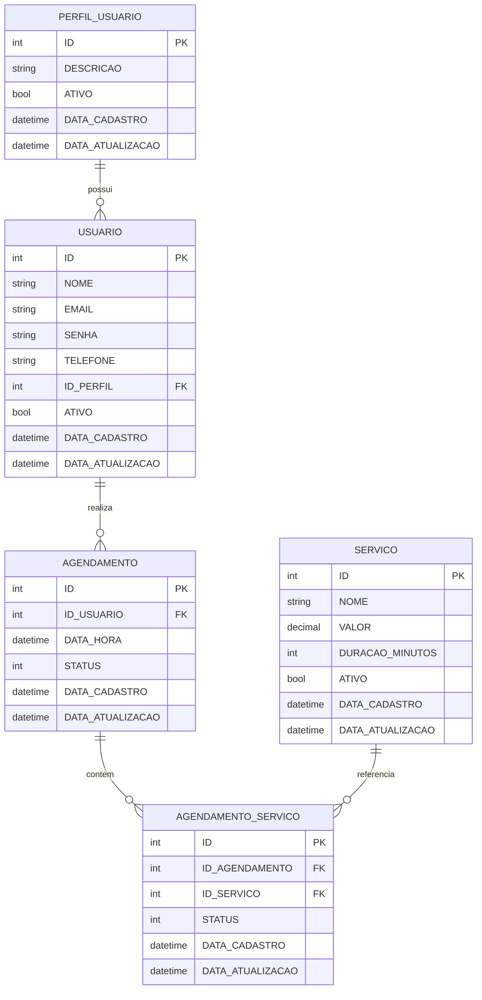
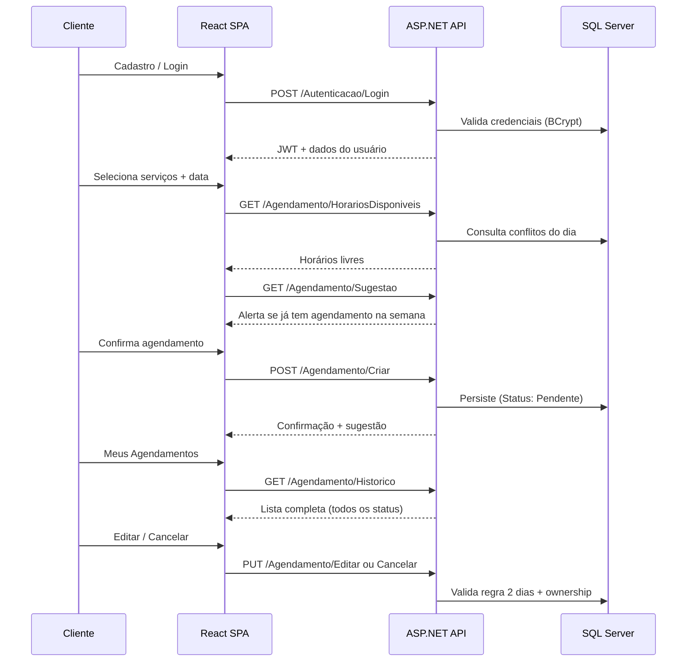
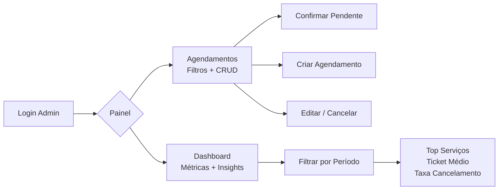

# 💇 Cabeleleila Leila — Sistema de Agendamento Online

> Plataforma full stack para gestão de agendamentos de salão de beleza, com portal do cliente e painel administrativo para a proprietária Leila.


---

## 📋 Índice

- [Objetivo](#-objetivo)
- [Tecnologias Utilizadas](#-tecnologias-utilizadas)
- [Arquitetura da Solução](#-arquitetura-da-solução)
- [Estrutura das Pastas](#-estrutura-das-pastas)
- [Regras de Negócio](#-regras-de-negócio-implementadas)
- [Funcionalidades Obrigatórias](#-funcionalidades-obrigatórias)
- [Funcionalidades Opcionais](#-funcionalidades-opcionais)
- [Modelo do Banco de Dados](#-modelo-do-banco-de-dados)
- [Fluxo da Aplicação](#-fluxo-da-aplicação)
- [Telas da Aplicação](#-telas-da-aplicação)
- [Como Executar](#-como-executar)
- [Migrations](#-migrations)
- [Testes](#-testes)
- [Endpoints da API](#-endpoints-principais-da-api)
- [Melhorias Futuras](#-melhorias-futuras)
- [Decisões Técnicas](#-decisões-técnicas)
- [Considerações Finais](#-considerações-finais)

---

## 🎯 Objetivo

Desenvolver um sistema web completo que permita aos **clientes** agendar, consultar, editar e cancelar serviços de beleza online, e à **administradora (Leila)** gerenciar a operação do salão com visibilidade sobre agendamentos, confirmações e desempenho do negócio.

O projeto foi construído como solução de **prova técnica**, priorizando:

- Separação clara de responsabilidades em camadas
- Regras de negócio centralizadas no backend
- Interface responsiva e intuitiva
- Segurança via autenticação JWT e controle de perfis

---

## 🛠 Tecnologias Utilizadas

### Backend

| Tecnologia | Versão | Finalidade |
|---|---|---|
| .NET | 10.0 | Runtime e API REST |
| ASP.NET Core | 10.0 | Controllers, middleware, hosting |
| Entity Framework Core | 10.0.9 | ORM e migrations |
| SQL Server | Local | Persistência relacional |
| JWT Bearer | 10.0.9 | Autenticação stateless |
| BCrypt.Net-Next | 4.0.3 | Hash de senhas |
| AutoMapper | 14.0.0 | Mapeamento entidade ↔ DTO |
| Serilog | 10.0.0 | Logging estruturado |
| Swashbuckle | 10.2.3 | Documentação Swagger/OpenAPI |

### Frontend

| Tecnologia | Versão | Finalidade |
|---|---|---|
| React | 19.2 | Interface SPA |
| TypeScript | 6.0 | Tipagem estática |
| Vite | 8.1 | Build tool e dev server |
| Material UI (MUI) | 9.1 | Componentes e design system |
| React Router | 7.18 | Roteamento client-side |
| Axios | 1.18 | Cliente HTTP |
| React Toastify | 11.1 | Notificações de feedback |

---

## 🏗 Arquitetura da Solução

A solução segue **arquitetura em camadas (Clean Architecture simplificada)**, com dependências unidirecionais e inversão via interfaces no projeto `Domain`.



### Camadas e responsabilidades

| Camada | Projeto | Responsabilidade |
|---|---|---|
| **Apresentação** | `Api` + `ClientApp` | HTTP, autenticação, SPA, static files |
| **Aplicação** | `Business` | Regras de negócio, orquestração, validações |
| **Infraestrutura** | `Data` | EF Core, repositórios, Unit of Work, migrations |
| **Domínio** | `Domain` | Entidades, enums, DTOs, contratos (interfaces) |
| **Cross-cutting** | `CrossCutting` | Registro de dependências (DI) |

### Padrões adotados

- **Repository Pattern** — abstração de acesso a dados
- **Unit of Work** — controle transacional de commits
- **DTO Pattern** — contratos de entrada/saída da API
- **Service Layer** — concentração das regras de negócio
- **JWT + Role-based Authorization** — controle de acesso Admin/Cliente

---

## 📁 Estrutura das Pastas

```
SalaoBeleza/
├── SalaoBeleza.sln
├── README.md
└── src/
    ├── Domain/                    # Núcleo do domínio (sem dependências externas)
    │   ├── Entities/              # Agendamento, Usuario, Servico...
    │   ├── Enums/                 # StatusAgendamento, StatusServico, PerfilEnum
    │   ├── Dto/                   # Contratos de request/response
    │   └── Interfaces/            # IAgendamentoService, IUnitOfWork...
    │
    ├── Data/                      # Persistência
    │   ├── Context/               # SalaoCabeleleilaDbContext
    │   ├── Repositories/          # AgendamentoRepository, BaseRepository
    │   ├── UoW/                   # UnitOfWork
    │   └── Migrations/            # EF Core migrations
    │
    ├── Business/                  # Regras de negócio
    │   ├── Service/               # AgendamentoService, DashboardService...
    │   ├── Helpers/               # AgendamentoHorarioHelper
    │   ├── Configurations/        # JwtSettings, SalaoHorarioConfig
    │   └── Mappings/              # AutoMapper profiles
    │
    ├── CrossCutting/              # Composição / DI
    │   └── ScopeInjectors/        # DependencyInjection.cs
    │
    └── Api/                       # Host ASP.NET Core
        ├── Controllers/           # REST endpoints
        ├── Configurations/        # JWT, Swagger, CORS
        ├── ClientApp/             # Frontend React (Vite)
        │   └── src/
        │       ├── pages/         # Telas cliente e admin
        │       ├── components/    # Layout, dialogs, cards
        │       ├── services/      # Cliente Axios (api.ts)
        │       ├── contexts/      # AuthContext (JWT)
        │       ├── types/         # Interfaces TypeScript
        │       └── utils/         # Helpers de agendamento
        └── wwwroot/               # Build de produção do frontend
```

---

## 📐 Regras de Negócio Implementadas

### Agendamento

| Regra | Cliente | Admin |
|---|---|---|
| Mínimo de **2 dias de antecedência** para criar | ✅ | ❌ (isento) |
| Mínimo de **2 dias de antecedência** para editar/cancelar | ✅ | ❌ (isento) |
| Agendamento com **múltiplos serviços** | ✅ | ✅ |
| Validação de **conflito de horário** (intervalo `[início, fim)`) | ✅ | ✅ |
| Respeito ao **horário de funcionamento** (08:00–18:00) | ✅ | ✅ |
| Slots gerados a cada **30 minutos** | ✅ | ✅ |
| **Sugestão** de agendar na mesma data quando já existe agendamento na semana | ✅ | ✅ (informativo) |
| Status inicial ao criar | `Pendente` | `Confirmado` |

### Horários e conflitos

- A duração total do agendamento é a **soma das durações** de todos os serviços selecionados.
- Dois agendamentos **conflitam** se seus intervalos se sobrepõem; horários **encostados** (ex.: 10:00–10:30 e 10:30–11:00) **não conflitam**.
- Horários passados não são oferecidos na listagem de disponibilidade.

### Status

**Agendamento:** `Pendente` → `Confirmado` → `Concluido` | `Cancelado`

**Serviço (item):** `Pendente` → `EmAndamento` → `Concluido` | `Cancelado`

- Ao concluir todos os serviços, o agendamento passa automaticamente para `Concluido`.
- Admin pode alterar status individual de cada serviço via painel.

### Autenticação e perfis

| Perfil | Role JWT | Permissões |
|---|---|---|
| Admin (Leila) | `Admin` | Dashboard, CRUD agendamentos, confirmar, listar clientes |
| Cliente | `Cliente` | Agendar, histórico, editar/cancelar próprios agendamentos |

---

## ✅ Funcionalidades Obrigatórias

| # | Funcionalidade | Status | Onde |
|---|---|---|---|
| 1 | Agendar **múltiplos serviços** em um único horário | ✅ | `AgendarPage` + `AgendamentoService.CriarAsync` |
| 2 | **Alterar** agendamento (regra de 2 dias para cliente) | ✅ | `HistoricoPage` + `AgendamentoService.EditarAsync` |
| 3 | **Histórico** de agendamentos por período | ✅ | `HistoricoPage` + `GET /Agendamento/Historico` |
| 4 | **Detalhes** do agendamento (serviços, valores, status) | ✅ | Dialog de detalhes + `GET /Agendamento/BuscarPorId` |
| 5 | **Sugestão** de mesma semana ao agendar | ✅ | `AgendarPage` + `GET /Agendamento/Sugestao` |

---

## ⭐ Funcionalidades Opcionais

| # | Funcionalidade | Status | Onde |
|---|---|---|---|
| 1 | Admin: **listar** agendamentos recebidos | ✅ | `AgendamentosPage` + `ListarRecebidos` |
| 2 | Admin: **confirmar** agendamentos pendentes | ✅ | `AgendamentosPage` + `Confirmar` |
| 3 | Admin: **alterar status** de serviços | ✅ | API `AlterarStatusServico` |
| 4 | Admin: **dashboard** de desempenho | ✅ | `DashboardPage` + `DashboardService` |
| 5 | Admin: **criar** agendamentos para clientes | ✅ | `AgendamentoAdminDialog` + `CriarAdmin` |
| 6 | Admin: **editar** agendamentos existentes | ✅ | `AgendamentoAdminDialog` + `Editar` |
| 7 | Admin: **filtros** avançados (período, status, busca) | ✅ | Dashboard e Agendamentos |
| 8 | Admin: **insights** para tomada de decisão | ✅ | Taxa cancelamento, ticket médio, top serviços |

---

## 🗃 Modelo do Banco de Dados

**Banco de desenvolvimento:** `SalaoCabeleleila_Dev`  
**Banco de produção:** `SalaoCabeleleila`



### Dados iniciais (seed)

**Perfis:**

| ID | Descrição |
|---|---|
| 1 | Admin |
| 2 | Cliente |

**Serviços:**

| Serviço | Valor | Duração |
|---|---|---|
| Corte de Cabelo | R$ 50,00 | 30 min |
| Escova | R$ 40,00 | 45 min |
| Coloração | R$ 120,00 | 120 min |
| Manicure | R$ 35,00 | 40 min |

**Usuário admin** (seed em Development via `Program.cs`):

| Campo | Valor |
|---|---|
| E-mail | `admin@cabeleleila.com` |
| Senha | `Admin@123` |

---

## 🔄 Fluxo da Aplicação

### Fluxo do Cliente



### Fluxo da Admin (Leila)



---

## 📸 Telas da Aplicação

> Adicione os screenshots na pasta `docs/screenshots/` e substitua os placeholders abaixo.

### Cliente

| Tela | Descrição | Screenshot |
|---|---|---|
| Login | Autenticação com e-mail e senha | _[docs/screenshots/login.png]_ |
| Cadastro | Registro de novo cliente | _[docs/screenshots/cadastro.png]_ |
| Agendar | Seleção de serviços, data e horário | _[docs/screenshots/agendar.png]_ |
| Meus Agendamentos | Histórico, detalhes, editar e cancelar | _[docs/screenshots/historico.png]_ |

### Admin (Leila)

| Tela | Descrição | Screenshot |
|---|---|---|
| Dashboard | Métricas, gráficos e insights | _[docs/screenshots/dashboard.png]_ |
| Agendamentos | Gestão, filtros, criar e editar | _[docs/screenshots/admin-agendamentos.png]_ |

---

## 🚀 Como Executar

### Pré-requisitos

- [.NET SDK 10.0+](https://dotnet.microsoft.com/download)
- [Node.js 20+](https://nodejs.org/) e npm
- [SQL Server](https://www.microsoft.com/sql-server) (LocalDB ou instância local)
- Git

### 1. Clonar o repositório

```bash
git clone <url-do-repositorio>
cd SalaoBeleza
```

### 2. Configurar connection string

Edite `src/Api/appsettings.Development.json` se necessário:

```json
{
  "ConnectionStrings": {
    "DefaultConnection": "Server=localhost;Database=SalaoCabeleleila_Dev;Trusted_Connection=True;TrustServerCertificate=True;"
  }
}
```

### 3. Executar o backend

```bash
dotnet restore
dotnet run --project src/Api
```

| Ambiente | URL |
|---|---|
| HTTP | http://localhost:5222 |
| HTTPS | https://localhost:7175 |
| Swagger (Dev) | http://localhost:5222/swagger |

> Em **Development**, as migrations são aplicadas automaticamente e o usuário admin é criado via seed.

### 4. Executar o frontend (modo desenvolvimento)

Em outro terminal:

```bash
cd src/Api/ClientApp
npm install
npm run dev
```

| Ambiente | URL |
|---|---|
| Vite Dev Server | http://localhost:5173 |

O proxy do Vite encaminha chamadas `/Agendamento`, `/Usuario`, `/Autenticacao`, `/Servico` e `/Dashboard` para `http://localhost:5222`.

### 5. Build de produção (frontend integrado à API)

```bash
cd src/Api/ClientApp
npm run build
```

O output é gerado em `src/Api/wwwroot/`. Com a API rodando, acesse http://localhost:5222 — a SPA é servida como static files com fallback para `index.html`.

### Credenciais de acesso

| Perfil | E-mail | Senha |
|---|---|---|
| Admin | admin@cabeleleila.com | Admin@123 |
| Cliente | _(cadastre via /cadastro)_ | — |

---

## 🗄 Migrations

As migrations ficam em `src/Data/Migrations/`.

### Aplicar migrations manualmente

```bash
dotnet ef database update --project src/Data --startup-project src/Api
```

### Criar nova migration

```bash
dotnet ef migrations add NomeDaMigration --project src/Data --startup-project src/Api
```

### Histórico de migrations

| Migration | Descrição |
|---|---|
| `InitialCreate` | Criação das 5 tabelas + seed de perfis |
| `AjustePrecisaoServico` | Ajuste de precisão decimal do campo VALOR |
| `SeedServicosECascade` | Seed dos 4 serviços iniciais |

> **Nota:** Em ambiente Development, `Program.cs` executa `db.Database.Migrate()` automaticamente na inicialização.

---

## 🧪 Testes

Atualmente **não há projeto de testes automatizados** na solução.

A estratégia de validação adotada nesta entrega foi:

- Testes manuais via interface (cliente e admin)
- Validação de regras de negócio no backend (`AgendamentoService`)
- Swagger para inspeção dos endpoints em Development

### Sugestão para adicionar testes

```bash
# Exemplo: criar projeto de testes
dotnet new xunit -n SalaoBeleza.Tests
dotnet add SalaoBeleza.Tests reference src/Business/Business.csproj
dotnet sln add SalaoBeleza.Tests/SalaoBeleza.Tests.csproj
dotnet test
```

**Prioridades sugeridas para cobertura:**

1. `AgendamentoHorarioHelper` — conflitos e cálculo de duração
2. `AgendamentoService` — regra de 2 dias, múltiplos serviços, cancelamento
3. `DashboardService` — métricas e insights
4. Testes de integração dos controllers com banco in-memory

---

## 📡 Endpoints Principais da API

Base URL: `http://localhost:5222`

### Autenticação

| Método | Rota | Auth | Descrição |
|---|---|---|---|
| `POST` | `/Autenticacao/Login` | Público | Login e geração de JWT |

### Usuário

| Método | Rota | Auth | Descrição |
|---|---|---|---|
| `POST` | `/Usuario/Cadastrar` | Público | Cadastro de cliente |
| `GET` | `/Usuario/BuscarDados` | JWT | Dados do usuário logado |
| `GET` | `/Usuario/Listar` | Admin | Listar todos os usuários |

### Serviços

| Método | Rota | Auth | Descrição |
|---|---|---|---|
| `GET` | `/Servico/Listar` | Público | Serviços ativos do salão |

### Agendamentos

| Método | Rota | Auth | Descrição |
|---|---|---|---|
| `POST` | `/Agendamento/Criar` | Cliente | Criar agendamento |
| `POST` | `/Agendamento/CriarAdmin` | Admin | Criar agendamento para cliente |
| `PUT` | `/Agendamento/Editar` | JWT | Editar agendamento |
| `PUT` | `/Agendamento/Cancelar/{id}` | JWT | Cancelar agendamento |
| `GET` | `/Agendamento/BuscarPorId/{id}` | JWT | Detalhes do agendamento |
| `GET` | `/Agendamento/Historico` | JWT | Histórico por período |
| `GET` | `/Agendamento/Sugestao` | JWT | Sugestão mesma semana |
| `GET` | `/Agendamento/HorariosDisponiveis` | JWT | Slots livres por data/serviços |
| `GET` | `/Agendamento/ListarRecebidos` | Admin | Listagem operacional com filtros |
| `PUT` | `/Agendamento/Confirmar/{id}` | Admin | Confirmar pendente |
| `PUT` | `/Agendamento/AlterarStatusServico` | Admin | Alterar status de um serviço |

### Dashboard

| Método | Rota | Auth | Descrição |
|---|---|---|---|
| `GET` | `/Dashboard/DesempenhoSemanal` | Admin | Métricas e insights por período |

**Query params do dashboard:** `?dataInicio=2026-06-01&dataFim=2026-06-30`

**Query params de ListarRecebidos:** `?dataInicio=&dataFim=&status=1&buscaCliente=Maria`

---

## 🔮 Melhorias Futuras

| Prioridade | Melhoria | Benefício |
|---|---|---|
| 🔴 Alta | Projeto de **testes automatizados** (unit + integration) | Confiabilidade e regressão |
| 🔴 Alta | **Notificações** (e-mail/WhatsApp) de confirmação e lembrete | Redução de no-show |
| 🟡 Média | **Exportação CSV/PDF** do dashboard e relatórios | Tomada de decisão offline |
| 🟡 Média | **Comparativo de períodos** no dashboard (semana anterior) | Análise de tendência |
| 🟡 Média | CRUD de **serviços** pelo painel admin | Autonomia da Leila |
| 🟡 Média | **Recuperação de senha** por e-mail | Experiência do cliente |
| 🟢 Baixa | **Dark mode** e temas customizáveis | Acessibilidade visual |
| 🟢 Baixa | **CI/CD** (GitHub Actions) com build + test + deploy | Entrega contínua |
| 🟢 Baixa | Containerização com **Docker Compose** | Ambiente reproduzível |
| 🟢 Baixa | **Rate limiting** e refresh token JWT | Segurança reforçada |

---

## 🧠 Decisões Técnicas

### 1. Arquitetura em camadas com Domain isolado

**Decisão:** Manter o `Domain` sem dependências de frameworks.  
**Motivo:** Facilita testabilidade, evolução e clareza de responsabilidades — padrão esperado em projetos de nível pleno/sênior.

### 2. JWT stateless em vez de sessão server-side

**Decisão:** Autenticação via Bearer Token com claims (Id, Nome, Email, Role).  
**Motivo:** Simplicidade para SPA, escalabilidade horizontal e compatibilidade com APIs REST.

### 3. BCrypt para hash de senhas

**Decisão:** `BCrypt.Net-Next` com salt automático.  
**Motivo:** Algoritmo robusto e amplamente adotado; evita armazenamento de senhas em texto plano.

### 4. Validações no Service Layer (não FluentValidation ativo)

**Decisão:** Métodos `ValidarCamposObrigatorios()` nos DTOs + regras no `AgendamentoService`.  
**Motivo:** Controle explícito das regras de negócio no serviço; FluentValidation está referenciado mas não configurado — candidato a refactor futuro.

### 5. Intervalo semiaberto `[início, fim)` para conflitos

**Decisão:** Horários encostados não conflitam.  
**Motivo:** Maximiza ocupação do salão sem sobreposição real de atendimento.

### 6. SPA servida pelo próprio ASP.NET Core

**Decisão:** Build do React em `wwwroot` + `MapFallbackToFile("index.html")`.  
**Motivo:** Deploy simplificado (um único artefato); em dev, Vite com proxy mantém hot reload.

### 7. Auto-migrate + seed apenas em Development

**Decisão:** `db.Database.Migrate()` e `SeedAdminAsync()` condicionados a `IsDevelopment()`.  
**Motivo:** Facilita onboarding do avaliador; evita seeds indesejados em produção.

### 8. Normalização camelCase no frontend

**Decisão:** Interceptor Axios que normaliza chaves PascalCase → camelCase.  
**Motivo:** Resiliência entre serialização .NET e consumo TypeScript, evitando bugs silenciosos na UI.

### 9. Dashboard com insights automáticos

**Decisão:** Geração de mensagens contextuais (taxa cancelamento, pico, serviço popular).  
**Motivo:** Transformar dados brutos em informação acionável para a proprietária do salão.

### 10. Admin cria agendamentos já confirmados

**Decisão:** `CriarPorAdminAsync` define status `Confirmado` e isenta regra de 2 dias.  
**Motivo:** Reflete operação real — quando Leila agenda por telefone/balcão, o slot já está garantido.

---

## 📝 Considerações Finais

Este projeto demonstra a construção de uma **aplicação full stack production-ready** para um domínio real (salão de beleza), com:

- **Backend robusto** — regras de negócio centralizadas, validações de conflito, controle de perfis e API documentada via Swagger
- **Frontend moderno** — React 19 + MUI 9, fluxos distintos para cliente e admin, feedback visual com toasts
- **Persistência estruturada** — EF Core com migrations versionadas e seed de dados iniciais
- **Segurança** — JWT, BCrypt, autorização por roles e validação de ownership nos agendamentos

O sistema atende **100% dos requisitos obrigatórios** da prova técnica e implementa **todas as funcionalidades opcionais** propostas, incluindo dashboard analítico, gestão operacional completa e CRUD administrativo de agendamentos.

---

<p align="center">
  Desenvolvido com ☕ para a <strong>Cabeleleila Leila</strong>
  <br />
  <sub>Prova Técnica · .NET + React · 2026</sub>
</p>
